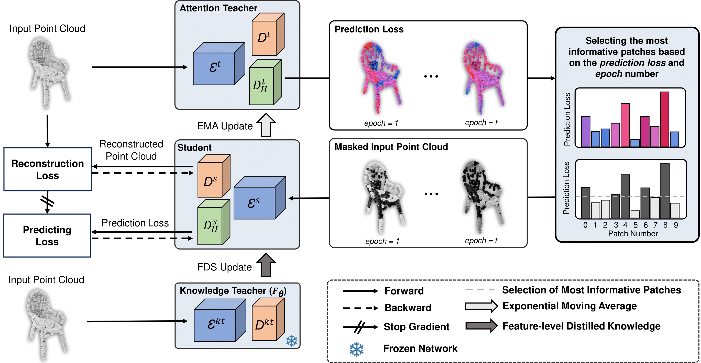

# Selective Attention in 3D: Geometrically Informed Mask Selection for Self-Supervised Point Cloud Learning

The official implementation of our paper "Selective Attention in 3D: Geometrically Informed Mask Selection for Self-Supervised Point Cloud Learning".



### Requirements
- [Python 3.8](https://www.python.org/)
- [CUDA 11.8](https://developer.nvidia.com/cuda-zone)
- [PyTorch 1.13.1](https://pytorch.org/)
- [TorchVision 0.14.1](https://pytorch.org/)
- [Numpy 1.24.3](https://numpy.org/)
- [timm 0.4.5](https://github.com/rwightman/pytorch-image-models)

Other packages:
```
pip install -r requirements.txt
```
