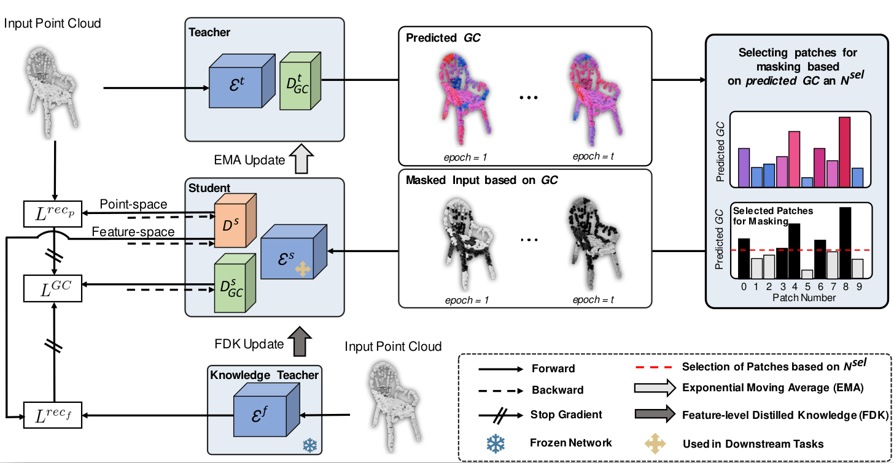

# GeoMask3D: Geometrically Informed Mask Selection for Self-Supervised Point Cloud Learning in 3D

The official implementation of our paper "GeoMask3D: Geometrically Informed Mask Selection for Self-Supervised Point Cloud Learning in 3D".



We introduce a pioneering approach to self-supervised learning for point clouds, employing a geometrically informed mask selection strategy, referred to as GeoMask3D, to boost the efficiency of MAEs. Unlike the conventional method of random masking, our technique utilizes a teacher-student model to focus on intricate areas within the data, guiding the model's focus toward regions with higher geometric complexity. This strategy is grounded in the hypothesis that concentrating on harder patches yields a more robust feature representation, as evidenced by the improved performance on downstream tasks. 
Our method also presents a complete-to-partial feature-level knowledge distillation technique designed to guide the prediction of geometric complexity utilizing a comprehensive context from feature-level information.
Extensive experiments confirm our method's superiority over SOTA baselines, demonstrating marked improvements in classification, segmentation, and few-shot tasks.


### Requirements
- [Python 3.8](https://www.python.org/)
- [CUDA 11.8](https://developer.nvidia.com/cuda-zone)
- [PyTorch 1.13.1](https://pytorch.org/)
- [TorchVision 0.14.1](https://pytorch.org/)
- [Numpy 1.24.3](https://numpy.org/)
- [timm 0.4.5](https://github.com/rwightman/pytorch-image-models)

Other packages:
```
pip install -r requirements.txt
```

```
# Chamfer Distance & emd
cd ./extensions/chamfer_dist
python setup.py install --user
cd ./extensions/emd
python setup.py install --user
# PointNet++
pip install "git+https://github.com/erikwijmans/Pointnet2_PyTorch.git#egg=pointnet2_ops&subdirectory=pointnet2_ops_lib"
# GPU kNN
pip install --upgrade https://github.com/unlimblue/KNN_CUDA/releases/download/0.2/KNN_CUDA-0.2-py3-none-any.whl
```

### Datasets

We use ShapeNet, ScanObjectNN, ModelNet40 and ShapeNetPart in this work. See [Point-MAE Repo](https://github.com/Pang-Yatian/Point-MAE/blob/main/DATASET.md) for details.


### Pre-training
Pre-trained by ShapeNet, Point-MAE+GM3D and Point-M2AE+GM3D are evaluated by **Linear SVM** on ModelNet40 dataset, without downstream fine-tuning:
| Model | Task | Dataset | Config | MN40 Acc.| 
| :-----: | :-----: |:-----:| :-----: | :-----: |
| Point-MAE+GM3D | Pre-training | ShapeNet |[point-mae+GM3D.yaml](./Point-MAE_SA3D/cfgs/config.yaml)| 92.30% |
| Point-M2AE+GM3D | Pre-training | ShapeNet |[point-m2ae+GM3D.yaml](./Point-M2AE_SA3D/cfgs/config_Point_M2AE.yaml)| 93.15% |

### Fine-tuning
Synthetic shape classification on ModelNet40 with 1k points:
| Model | Task  | Config | Acc.| Vote | Logs |   
| :-----: | :-----:| :-----:| :-----: | :-----:| :-----:|
| Point-MAE+GM3D | Classification | [modelnet40.yaml](./Point-MAE_SA3D/cfgs/finetune_modelnet.yaml)|93.55%| 94.16% | [modelnet40.log](./Point-MAE_SA3D/log_files/modelnet40.log) |
| Point-M2AE+GM3D | Classification | [modelnet40.yaml](./Point-M2AE_SA3D/cfgs/finetune_modelnet_PointM2AE.yaml)|92.90%| 93.03% | [modelnet40.log](./Point-M2AE_SA3D/log_files/modelnet40.txt) |

Real-world shape classification on ScanObjectNN:
| Model | Task | Split | Config | Acc. | Logs |   
| :-----: | :-----:|:-----:| :-----:| :-----:|:-----:|
| Point-MAE+GM3D | Classification | PB-T50-RS|[scan_pb.yaml](./Point-MAE_SA3D/cfgs/config_finetune_scan_hardest.yaml) | 88.30%| [scan_pd.log](./Point-MAE_SA3D/log_files/hardest.txt) |
| Point-MAE+GM3D | Classification |OBJ-BG| [scan_obj-bg.yaml](./Point-MAE_SA3D/cfgs/config_finetune_scan_objbg.yaml) | 93.45%| [scan_obj-pd.log](./Point-MAE_SA3D/log_files/obj_bg.txt) |
| Point-MAE+GM3D | Classification | OBJ-ONLY| [scan_obj.yaml](./Point-MAE_SA3D/cfgs/config_finetune_scan_objonly.yaml) | 90.36%| [scan_obj.log](./Point-MAE_SA3D/log_files/obj_only.txt) |
| Point-M2AE+GM3D | Classification | PB-T50-RS|[scan_pb.yaml](./Point-M2AE_SA3D/cfgs/config_finetune_scan_hardest_PointM2AE.yaml) | 87.75%| [scan_pd.log](./Point-M2AE_SA3D/log_files/hardest.txt) |
| Point-M2AE+GM3D | Classification |OBJ-BG| [scan_obj-bg.yaml](./Point-M2AE_SA3D/cfgs/config_finetune_scan_objbg_PointM2AE.yaml) | 94.14%| [scan_obj-pd.log](./Point-M2AE_SA3D/log_files/obj_bg.txt) |
| Point-M2AE+GM3D | Classification | OBJ-ONLY| [scan_obj.yaml](./Point-M2AE_SA3D/cfgs/config_finetune_scan_objonly_PointM2AE.yaml) | 91.04%| [scan_obj.log](./Point-M2AE_SA3D/log_files/obj_only.txt) |

Part segmentation on ShapeNetPart:
| Model | Task | Dataset | mIoUc| mIoUi | Logs |   
| :-----: | :-----: |:-----:| :-----:| :-----: | :-----:|
| Point-MAE+GM3D | Segmentation | ShapeNetPart | 84.49% | 86.04% | [seg.log](./Point-MAE_SA3D/log_files/segmentation.txt) |
| Point-M2AE+GM3D | Segmentation | ShapeNetPart |84.91% | 86.52% | - |

Few-shot classification on ModelNet40:
| Model |  Task | Dataset | Config | 5w10s | 5w20s | 10w10s| 10w20s|     
| :-----: | :-----: |:-----:| :-----: | :-----:|:-----:|:-----:| :-----:|
| Point-MAE+GM3D |  Few-shot Cls. | ModelNet40 |[fewshot.yaml](./Point-MAE_SA3D/cfgs/fewshot.yaml) | 97.0%|98.3%|93.1%|95.2%| 


## Get Started

### Pre-training
Point-MAE+GM3D and Point-M2AEe+GM3D are pre-trained on ShapeNet dataset with the config files `./Point-MAE_SA3D/cfgs/config.yaml and ./Point-M2AE_SA3D/cfgs/config_Point_M2AE.yaml`. 

Run for Point-MAE+GM3D:
```bash
CUDA_VISIBLE_DEVICES=<GPUs> python main_pretrain.py --config ./Point-MAE_SA3D/cfgs/config.yaml  --output_dir ./address_for_saving_output_files --log_dir ./address_for_saving_output_files 
```
Run for Point-M2AE+GM3D:
```bash
CUDA_VISIBLE_DEVICES=<GPUs> python main_pretrain.py --config ./Point-M2AE_SA3D/cfgs/config_Point_M2AE.yaml --output_dir ./address_for_saving_output_files --log_dir ./address_for_saving_output_files 
```

### Fine-tuning
Please create a folder `ckpts/` and put pretrained_model in it.

For ModelNet40 (Point-MAE+GM3D), run:
```bash
CUDA_VISIBLE_DEVICES=<GPUs> python main_finetune.py --config ./Point-MAE_SA3D/cfgs/finetune_modelnet.yaml --output_dir ./address_for_saving_output_files --log_dir ./address_for_saving_output_files  --finetune Point-MAE_SA3D/ckpts/pretrained_model.pth
```

For ModelNet40 (Point-M2AE+GM3D), run:
```bash
CUDA_VISIBLE_DEVICES=<GPUs> python main_finetune.py --config ./Point-M2AE_SA3D/cfgs/finetune_modelnet_PointM2AE.yaml --output_dir ./address_for_saving_output_files --log_dir ./address_for_saving_output_files --finetune Point-M2AE_SA3D/ckpts/pretrained_model.pth
```

For the three splits of ScanObjectNN (Point-MAE+GM3D), run:

```bash
CUDA_VISIBLE_DEVICES=<GPUs> python main_finetune.py --config ./Point-MAE_SA3D/cfgs/config_finetune_scan_hardest.yaml --output_dir ./address_for_saving_output_files --log_dir ./address_for_saving_output_files  --finetune Point-MAE_SA3D/ckpts/pretrained_model.pth
```
```bash
CUDA_VISIBLE_DEVICES=<GPUs> python main_finetune.py --config /Point-MAE_SA3D/cfgs/config_finetune_scan_objonly.yaml --output_dir ./address_for_saving_output_files --log_dir ./address_for_saving_output_files --finetune Point-MAE_SA3D/ckpts/pretrained_model.pth
```
```bash
CUDA_VISIBLE_DEVICES=<GPUs> python main_finetune.py --config ./Point-MAE_SA3D/cfgs/config_finetune_scan_objbg.yaml --output_dir ./address_for_saving_output_files --log_dir ./address_for_saving_output_files --finetune Point-MAE_SA3D/ckpts/pretrained_model.pth
```

For the three splits of ScanObjectNN (Point-M2AE+GM3D), run:

```bash
CUDA_VISIBLE_DEVICES=<GPUs> python main_finetune.py --config ./Point-M2AE_SA3D/cfgs/config_finetune_scan_hardest_PointM2AE.yaml --output_dir ./address_for_saving_output_files --log_dir ./address_for_saving_output_files --finetune Point-M2AE_SA3D/ckpts/pretrained_model.pth
```
```bash
CUDA_VISIBLE_DEVICES=<GPUs> python main_finetune.py --config /Point-M2AE_SA3D/cfgs/config_finetune_scan_objonly_PointM2AE.yaml --output_dir ./address_for_saving_output_files --log_dir ./address_for_saving_output_files --finetune Point-M2AE_SA3D/ckpts/pretrained_model.pth
```
```bash
CUDA_VISIBLE_DEVICES=<GPUs> python main_finetune.py --config ./Point-M2AE_SA3D/cfgs/config_finetune_scan_objbg_PointM2AE.yaml --output_dir ./address_for_saving_output_files --log_dir ./address_for_saving_output_files --finetune Point-M2AE_SA3D/ckpts/pretrained_model.pth
```

For ShapeNetPart, first into the `segmentation/` folder, and run:
```bash
coming soon ...
```

For Few-shot, run:
```bash
coming soon ...
```

### Visualizations


The attention map's progression during training is shown, starting with random masks and evolving towards maximal selective attention. The background DRC loss plot demonstrates the effectiveness of the selective attention strategy in guiding MAEs to learn the informative regions. Notably, in a, the attention map is initially random. As training progresses b, c, it focuses on challenging areas like legs, reducing attention to the flat seat by epoch 100. Between epochs 200 and 300 d, the network can reconstruct challenging leg regions, leveraging earlier attention patterns and repeated leg geometry. Simultaneously, areas with fewer connections and less geometric information receive diminished attention e. By epoch 400 f, the distance between the attention maps decreases, indicating a more balanced focus across the patches. The flat-seat area is no longer excessively easier than other regions, with the DRC loss plot providing evidence for this change, however, geometrically complex regions remain under focus.


## Acknowledgements

Our codes are built upon [Point-MAE](https://github.com/Pang-Yatian/Point-MAE), [Point-M2AE](https://github.com/ZrrSkywalker/Point-M2AE) and [HPM](https://github.com/Haochen-Wang409/HPM). We thank the authors for releasing their codes.


